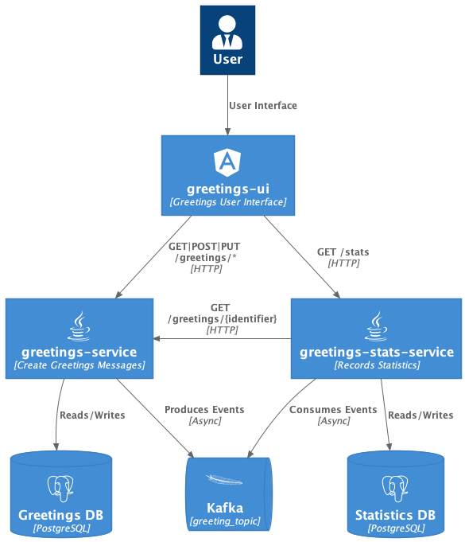

= Demonstration Project
:toc:
:toclevels: 3

== Builds

image::https://github.com/sokube/spring-test-example/actions/workflows/build.yml/badge.svg[https://github.com/sokube/spring-test-example/actions]

=== Greetings Service

image::https://sonarcloud.io/api/project_badges/measure?project=sokube-greetings-service&metric=alert_status[https://sonarcloud.io/dashboard?id=sokube-greetings-service]

image::https://sonarcloud.io/api/project_badges/measure?project=sokube-greetings-service&metric=sqale_rating[https://sonarcloud.io/dashboard?id=sokube-greetings-service]

image::https://sonarcloud.io/api/project_badges/measure?project=sokube-greetings-service&metric=vulnerabilities[https://sonarcloud.io/dashboard?id=sokube-greetings-service]

image::https://sonarcloud.io/api/project_badges/measure?project=sokube-greetings-service&metric=coverage[https://sonarcloud.io/dashboard?id=sokube-greetings-service]

=== Stat Service

image::https://sonarcloud.io/api/project_badges/measure?project=sokube-greetings-stat-service&metric=alert_status[https://sonarcloud.io/dashboard?id=sokube-greetings-stat-service]

image::https://sonarcloud.io/api/project_badges/measure?project=sokube-greetings-stat-service&metric=sqale_rating[https://sonarcloud.io/dashboard?id=sokube-greetings-stat-service]

image::https://sonarcloud.io/api/project_badges/measure?project=sokube-greetings-stat-service&metric=vulnerabilities[https://sonarcloud.io/dashboard?id=sokube-greetings-stat-service]

image::https://sonarcloud.io/api/project_badges/measure?project=sokube-greetings-stat-service&metric=coverage[https://sonarcloud.io/dashboard?id=sokube-greetings-stat-service]

== Architecture overview

.architecture overview

== List of patterns / concepts /technics demonstrated

* Hexagonal Architecture
* Multimodules Spring Boot Project
* REST API with Spring MVC (link:./greetings-service[greeting service]) and Spring Web Reactive (link:./greetings-stat-service[stat service])
* Kafka Consumer (link:./greetings-stat-service[stat service]) / producer (link:./greetings-service[greeting service])
* Reactive implementation (link:./greetings-stat-service[stat service])
* Test : Unit tests with Mockito and AssertJ
* Test : Integration tests with Spring Slice Tests Annotations
* Test : Integration tests with `@EmbeddedKafka`
* Test : CDC tests with https://docs.pact5.io[Pact]
* Test : BDD tests with Cucumber and JUnit 5